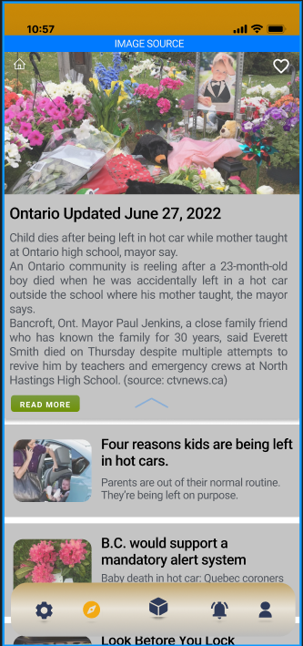
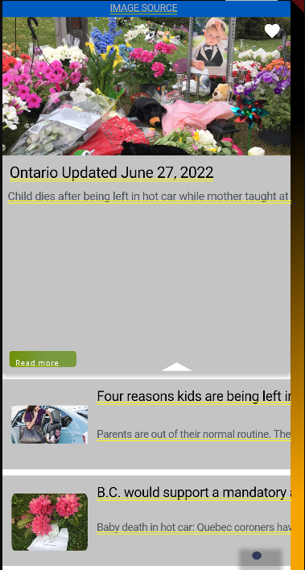
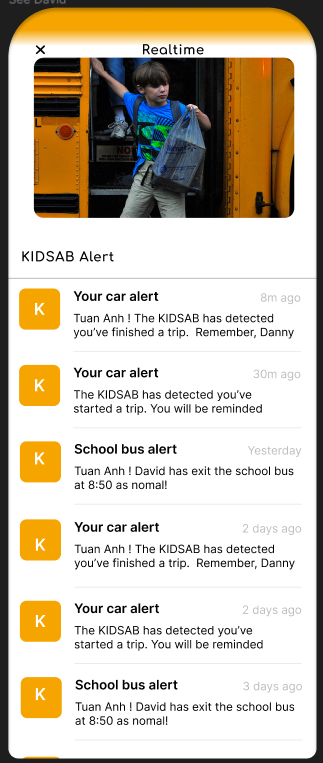
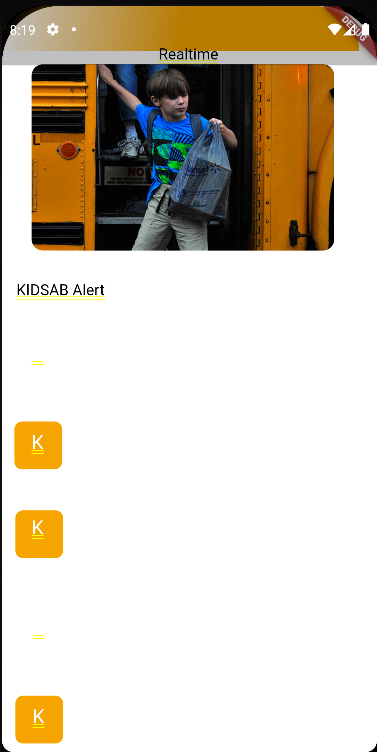

#REFERENCE: https://www.figma.com/community/plugin/844008530039534144

1. NEWS:
   Figma:
   

   Code gen:
   

2. Screen 2:
   Figma:
   

   Code gen:
   

---

Code screen:

- Layout tạm ổn
- Hỗ trợ tách các file assets
- Có options widget/stateless/stateful

- Phải chọn từng màn/components để gen
