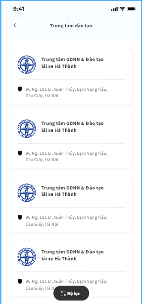
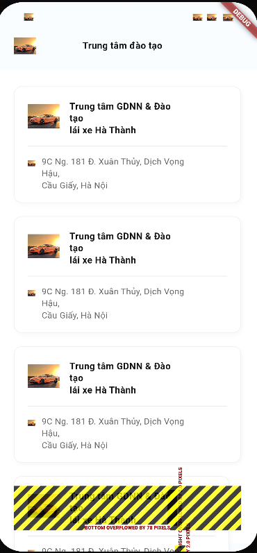

#REFERENCES:https://function12.io/figma-to-flutter

---

1 SCreen1:
Figma:

Code gen:

2. Screen 2

Figma:

Code gen:

---

- Layout khá đúng, có thể sử dụng, cần tinh chỉnh thêm
- Component có thể sử dụng
