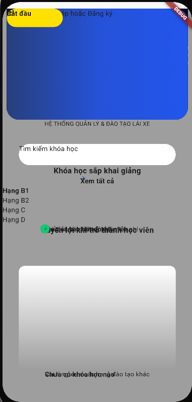
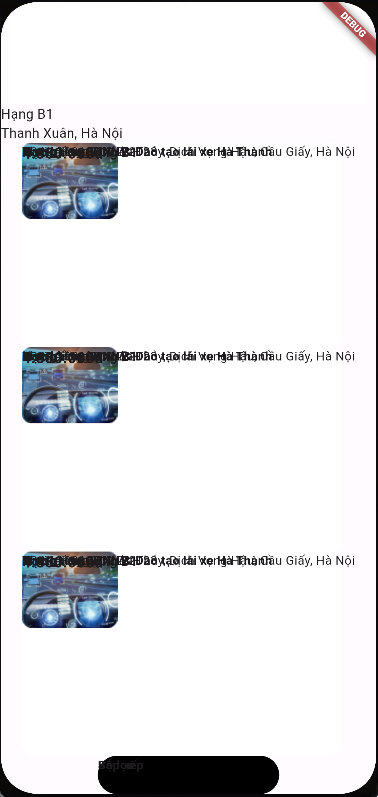

#References:https://www.figma.com/community/plugin/1253830573204770015/flutter

1 Screen1:

Figma:

Code:

2 Screen 2:
Figma:

Code:

---

- Full source code screen không tốt (vỡ layout)
- Code components có thể sử dụng
