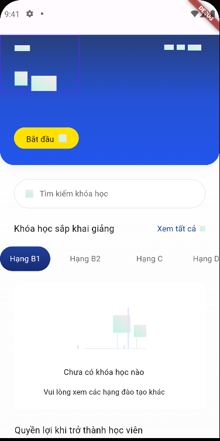
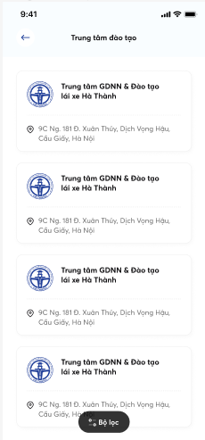
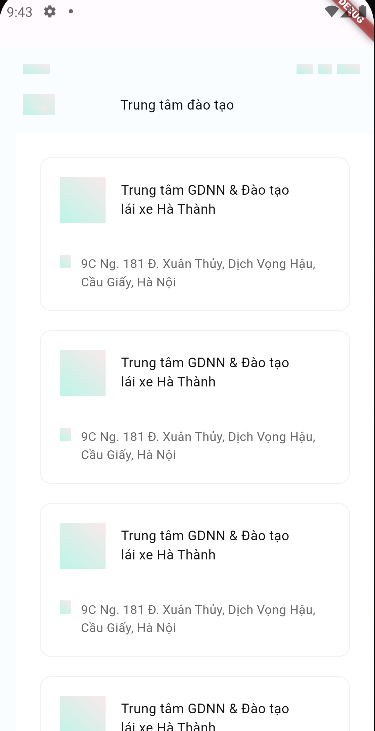

#REFERENCE: https://www.figma.com/community/plugin/1299643423790238613/tagjs-figma-to-code-react-native-flutter-swiftui-android-xml-native-ios-android
\n
1. Screen 1
   FIGMA: 
\n
CODE:

\n
2. Screen 2
   Figma: 
\n
Code: 
\n
---
\n
- Layout ổn\n
- Code components có thể sử dụng sau khi sửa
